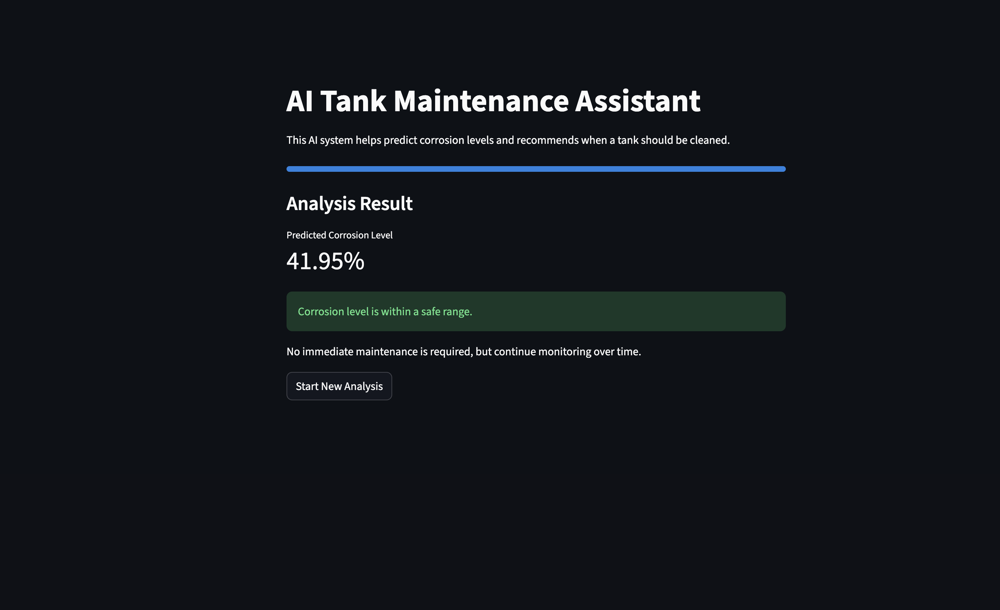
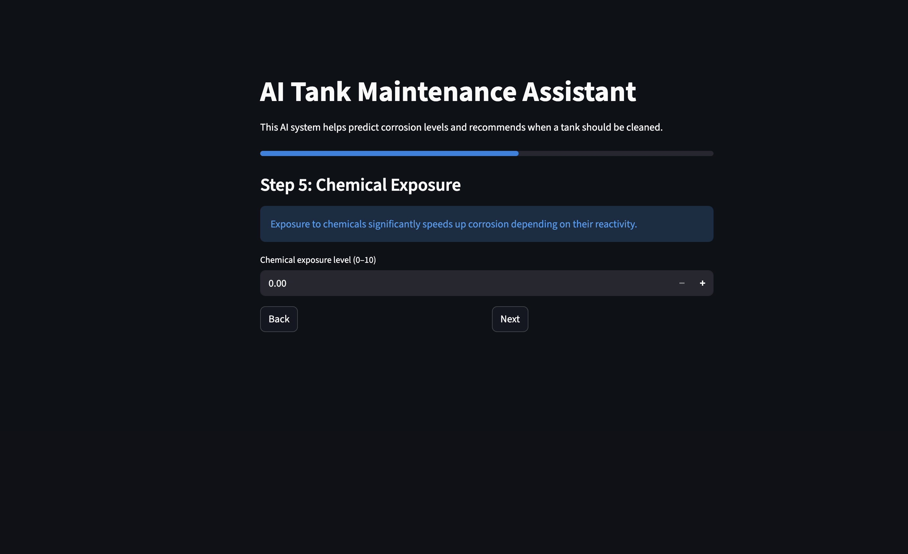

# AI-Powered Predictive Maintenance System for Industrial Tanks

## Overview
This project uses machine learning to predict corrosion levels in industrial tanks and recommend maintenance actions.

## Features
- Interactive AI assistant
- Step by step tank analysis
- Corrosion prediction using machine learning
- Maintenance recommendations
- Industrial data simulation

## Technologies Used
- Python
- Streamlit
- scikit-learn
- pandas
- numpy

## Purpose
This project was built to explore how AI and predictive maintenance can support industrial tank cleaning operations.

## Future Improvements
- Real-world industrial datasets
- Improved corrosion modeling
- Cloud deployment
- Real time monitoring

## Screenshots

